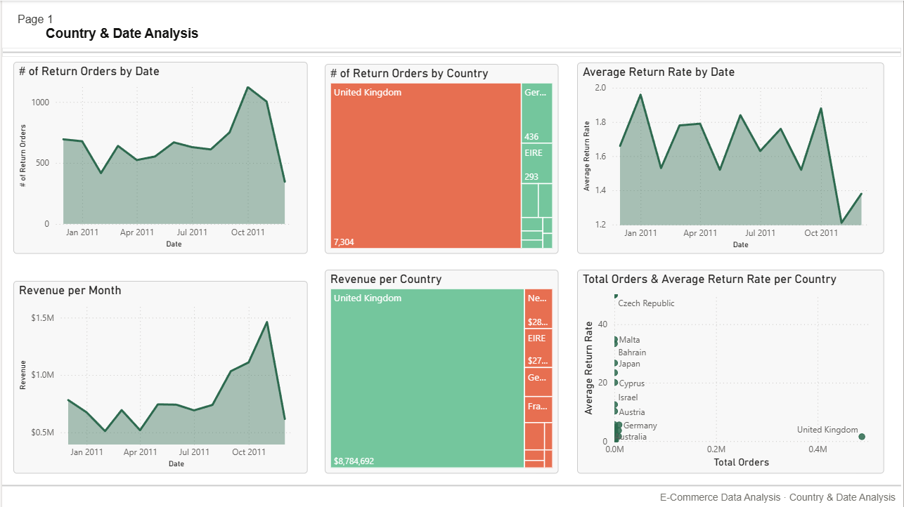
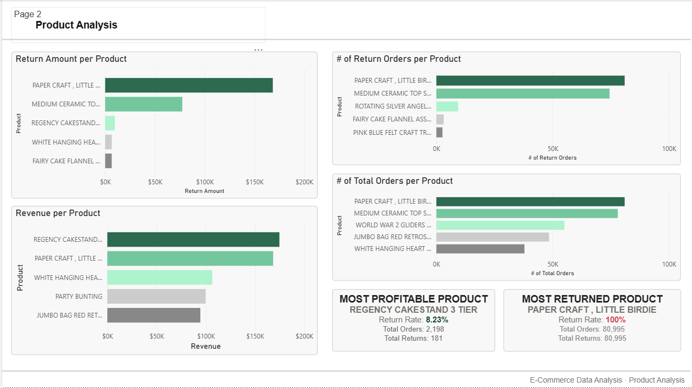
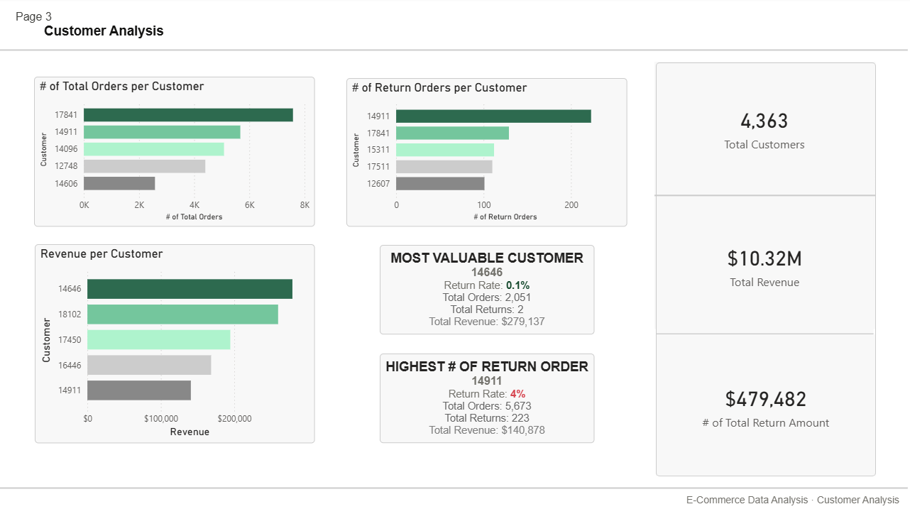

# E-Commerce Data Analysis
**Tool:** SQL Server (SSMS) · Power BI  
**Dataset:** [Kaggle — E-Commerce Data (UCI Online Retail)](https://www.kaggle.com/datasets/carrie1/ecommerce-data)  
**Author:** Lawrence André Q. Cabana · [LinkedIn](https://www.linkedin.com/in/lawrence-andr%C3%A9-cabana-1306b7295/)

---

## Overview

This project analyzes transactional data from a UK-based online retail business to investigate return order patterns, identify revenue drivers, and surface actionable recommendations for offsetting revenue loss caused by high return volumes.

The analysis was conducted entirely in SQL Server using SSMS for data preparation, exploration, and querying, with Power BI used for visualization and reporting.

---

## Business Problem

This UK-based online retail business is experiencing a high volume of returned orders, which is directly impacting total revenue. The root causes and patterns behind these returns are not yet fully understood, making it difficult for the business to take targeted corrective action. This analysis investigates return patterns across products, countries, and time, while identifying where the business is generating its strongest revenue, so the business can make informed decisions on where to focus its efforts to offset the impact of returns.

---

## Dataset

- **Source:** Kaggle — E-Commerce Data (carrie1/ecommerce-data)
- **Records:** ~400,000 transactions prior to cleaning
- **Features:** Invoice numbers, stock codes, product descriptions, quantities, unit prices, customer IDs, invoice dates, and country of order

---

## Tools Used

| Tool | Purpose |
|---|---|
| SQL Server (SSMS) | Data cleaning, feature engineering, analysis queries, views |
| Power BI Desktop | Dashboard and report visualization |

---

## Data Preparation

All data preparation was performed in SQL Server. The following custom columns were engineered from existing data:

| Column | Description |
|---|---|
| `PurchaseAmount` | Quantity multiplied by UnitPrice, applied only where Quantity is greater than 0 and InvoiceNo does not begin with 'C'. All other rows set to 0. |
| `ReturnedAmount` | Absolute value of Quantity multiplied by UnitPrice, applied only where PurchaseAmount is 0. |

**Cleaning steps:**
- Rows where both `CustomerID` and `Description` were null were dropped — no usable information retained
- Rows where `CustomerID` was null but `Description` held a value were assigned the identifier `'No ID'`
- Rows with a null `UnitPrice` were dropped — purchase and return amounts could not be calculated
- Rows where both `PurchaseAmount` and `ReturnedAmount` were 0 were dropped — no financial value
- Non-product rows were removed: `'Manual'`, `'POSTAGE'`, `'Discount'`, `'SAMPLES'`, `'CRUK Commission'`, `'Bank Charges'`, `'DOTCOM POSTAGE'`, `'AMAZON FEE'`

---

## Analysis Questions

| # | Question |
|---|---|
| Q1 | Are there identifiable patterns in returned orders across countries and months? |
| Q2 | Which countries and months contribute the most to total revenue? |
| Q3 | Which products have the highest purchase volume, and what is their contribution to total revenue? |
| Q4 | Which products have the highest return volume, and what is their estimated revenue loss contribution? |
| Q5 | How have return rates trended over time, and does this vary significantly by country? |
| Q6 | Which customers account for the highest return volume, and how does this compare to their overall purchase activity? |

---

## Key Findings

- **The United Kingdom** accounts for 7,304 returned orders — far exceeding any other market — but simultaneously contributes $8.7M in total revenue, making it the most critical market to both protect and improve
- **September to November 2011** recorded the highest return volumes and the highest revenue simultaneously, suggesting elevated return rates during this period are tied to peak transaction activity rather than a deterioration in quality
- **'PAPER CRAFT , LITTLE BIRDIE'** has a 100% return rate — every unit purchased was subsequently returned — rendering it a net-zero revenue contributor and a candidate for discontinuation
- **'REGENCY CAKESTAND 3 TIER'** is the highest revenue-generating product at $174,798 with a return loss of only $9,760, making it the business's most valuable product
- **The UK's return rate stays consistently below 2%** across all months despite processing upwards of 20,000 orders per month — a strong indicator of healthy transaction quality at scale
- **Customer 14911** holds the highest return count at 223 while also contributing $140,878 in total purchases, placing them in the top five customers by revenue — a high-value relationship worth preserving through targeted intervention

---

## Recommendation

The business should concentrate its efforts on the **United Kingdom market**, as it accounts for the overwhelming majority of total revenue and the highest absolute return volume. Improving transaction quality within this market — particularly for high-return products such as 'REGENCY CAKESTAND 3 TIER' — represents the greatest opportunity to offset revenue loss.

At the product level, **'PAPER CRAFT , LITTLE BIRDIE'** should be discontinued or significantly reviewed given its 100% return rate and zero net revenue contribution. At the customer level, a targeted account management approach for **customer 14911** could meaningfully reduce return volume while retaining a significant revenue contributor.

---

## Repository Structure

```
├── queries/
│   └── ecommerce_analysis.sql           # All analysis queries and views
├── findings/
│   └── ecommerce_findings.pdf           # Full write-up with findings and implications
├── visuals/
│   ├── page1_country_date_analysis.png
│   ├── page2_product_analysis.png
│   ├── page3_customer_analysis.png
│   └── page4_return_rate_over_time.png
└── README.md
```

---

## Dashboard Preview

### Page 1 — Country & Date Analysis


### Page 2 — Product Analysis


### Page 3 — Customer Analysis


### Page 4 — Return Rate Over Time


---

*This project is part of an ongoing data analyst portfolio. More projects coming soon.*
